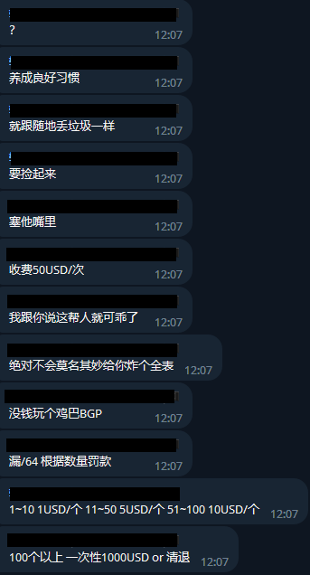

# 操作 BGP 过滤器时请注意！

管理 BGP 的路由不像管理你家里的网络一样容易，BGP 路由的泄露(常说的漏路由)往往会引发一些很严重的问题，比如 [这个例子](https://blog.cloudflare.com/bgp-leaks-and-crypto-currencies/) 。身为普通的 BGP Player，你随意喷射路由往往不会导致像上述例子那样严重的后果，但是你会被和你起 BGP 连接的其他 Player 们鄙视，如下图

<figure><figcaption></figcaption></figure>
